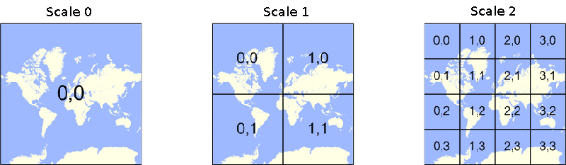

在mapbox-gl-js中有三种坐标：经纬度坐标，像素坐标和切片坐标。

# 经纬度坐标
我们最熟悉的是经纬度坐标，把地球划分成经度从-180度到180度，纬度从-90度到90度的范围，这是一种三维球体上的坐标。借助像素坐标和切片坐标我们可以在二维平面上显示地物。它们之间的桥梁就是[Web Mercator投影](https://en.wikipedia.org/wiki/Web_Mercator)。

# 切片坐标
切片有四个参数：
* tileSize: 切片的大小，单位是像素
* zoomLevel： 切片的级别，从0开始计数
* column： 切片的列编号
* row：切片的行编号

我们用(zoomLevel, column, row)来表示一个切片的坐标。

假设有一个矩形框，它的长和宽用tileSize表示。通过Web Mercator投影，我们可以把经度[-180, 180]，纬度[-85.051129, 85.051129]
的范围投影到这个矩形里。这个矩形就称为第0级的切片，它的切片坐标是(0,0,0)。

将这个矩形框的长和宽变成原来的两倍，即tileSize*2。通过Web Mercator投影，我们可以把经度[-180, 180]，纬度[-85.051129, 85.051129]
的范围投影到这个新的矩形里，然后按照tileSize的尺寸进行切割，这个矩形局域可以分成四个长宽均为tileSize的矩形，就得到了第1级的切片。以矩形
的左上角设为原点，第一级的四个切片坐标分别是(1,0,0)，(1,1,0)，(1,0,1)，(1,1,1)。

这样的放大——切割过程可以一直进行下去，形成切片地图的坐标系统。对于任意级别n的切片，它的行、列号范围是[0, 2^n - 1]。

# 像素坐标
第n级的切片，投影的矩形框大小是`tileSize * 2^n`。对于经纬度范围在[-180, 180]和[-85.051129, 85.051129]内的任何一个坐标，都可以对应投影矩形上的一个平面坐标，该平面坐标的原点在左上角，向左为X轴正方形，向下为Y轴正方向。像素坐标的范围是[0, tileSize * 2^n]。